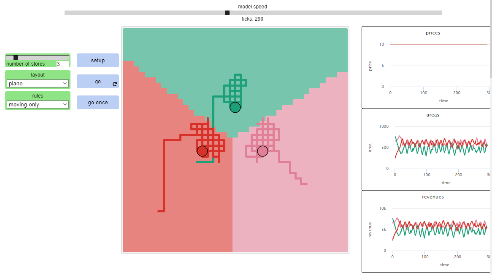
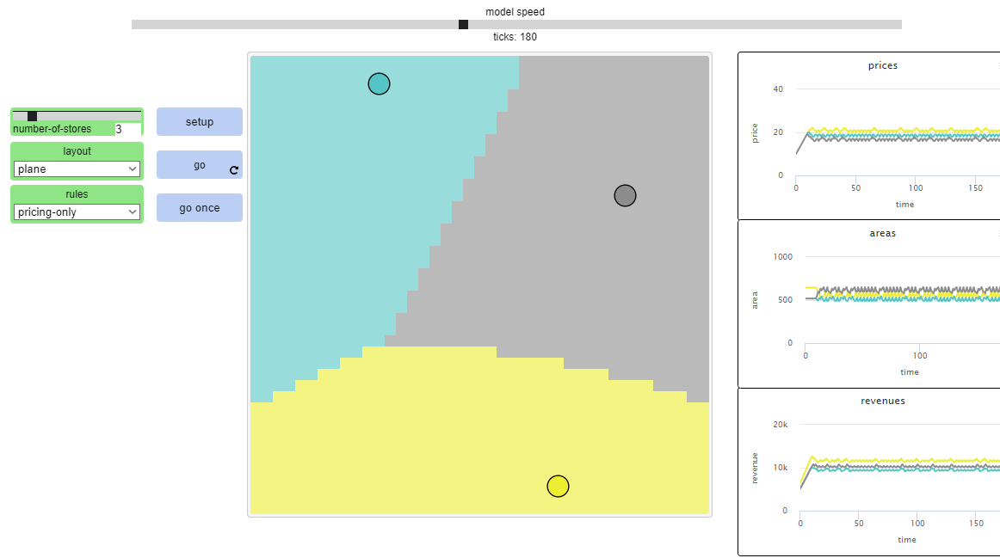
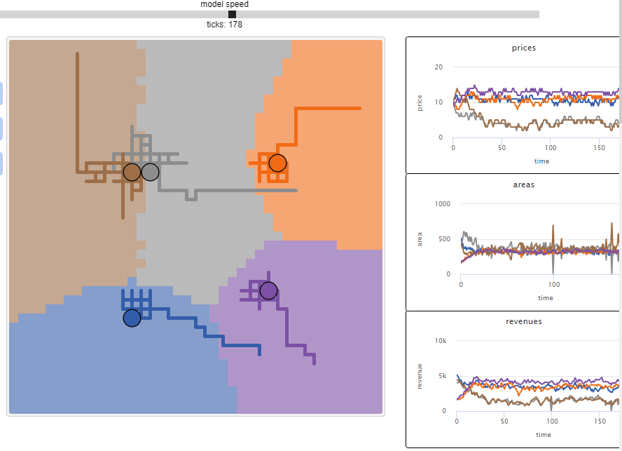

## Імітаційне моделювання комп'ютерних систем
## СПм-21-2, **Кравець Владислав Євгенович**
### Лабораторна робота №**1**. Опис імітаційних моделей та проведення обчислювальних експериментів

 

### Вибрана модель у середовищі NetLogo:
[Hotelling's Law](http://www.netlogoweb.org/launch#http://www.netlogoweb.org/assets/modelslib/Sample%20Models/Social%20Science/Economics/Hotelling's%20Law.nlogo)

 

### Вербальний опис моделі:
Ця модель є відображенням закону Хотеллінга (1929), який розглядає оптимальне розміщення магазинів і ціноутворення на їхні товари з метою максимізації прибутку. У оригінальній статті Хотеллінга магазини були обмежені одним виміром. Ця модель повторює і розширює закон Хотеллінга, дозволяючи магазинам вільно пересуватися по площині.

У цій моделі кілька магазинів намагаються максимізувати свої прибутки, змінюючи ціни. Кожен споживач обирає магазин, який йому подобається, виходячи з відстані до магазину та ціни товарів, які він пропонує.

### Як це працює:
Кожен споживач додає ціну та відстань до кожного магазину, а потім вибирає магазин, який пропонує найнижчу суму. У разі нічиєї, споживач вибирає випадковим чином. Магазини можуть бути обмежені одним виміром, у цьому випадку всі магазини працюють на лінії, або їх можна розмістити на площині. Згідно зі звичайним правилом, кожен магазин намагається випадково рухатися в чотирьох основних напрямках, щоб побачити, чи зможе він отримати більшу частку ринку; якщо ні, він не рухається. Потім кожен магазин перевіряє, чи може він отримати більший прибуток, збільшуючи або знижуючи ціну на свої товари; якщо ні, це не змінює ціну. Це рішення приймається без будь-яких знань про стратегії їхніх конкурентів. Є ще дві умови, за яких можна запустити цю модель: магазини можуть або лише змінювати ціни, або лише змінювати своє розташування.

### Керуючі параметри:
Якщо засіб вибору LAYOUT встановлено на LINE, то магазини працюватимуть лише в одному вимірі. Якщо це в PLANE, то магазини працюватимуть у двовимірному просторі.
Якщо для вибору RULES встановлено PRICING-ONLY, магазини можуть змінювати лише свої ціни. Якщо ввімкнути MOVING-ONLY, магазини можуть лише рухатися. Якщо він на NORMAL, усі магазини можуть змінювати свої ціни та рухатися.

 

## Обчислювальні експерименти

### 1. Спробуйте побачити, як магазини поводяться по-іншому, коли їм забороняють змінювати ціни.

у випадку коли магазинам дозволити тільки рухатися, вони ділять територію та мають однакові ціни

### 2. Подивіться, як магазини поводяться, коли їм забороняють рухатися.

Якщо магазинам дати можливість тільки змінювати ціни та не рухатись, то вони мають незначне коливання в цінах у себе.

### 3.Спробуйте збільшити кількість магазинів. Подивіться, як вони поводяться по-різному, і спостерігайте, які з них є найуспішнішими. Які закономірності виникають?

Найуспішнішим виявився фіолетовий магазин, бо він далі від всіх, має можливість підіймати ціни. А сірий з коричневим не можуть поділити територію, знижуючі ціни та втрачаючи прибуток.

